# Entity Relationship Diagram (ERD) - e-shoesbox

Dokumen ini berisi visualisasi struktur database untuk aplikasi **e-shoesbox** menggunakan diagram **Mermaid ERD**. Struktur data dikelompokkan berdasarkan domain yang didefinisikan dalam schema `.agents/schemas/`.

---

## 📸 Tautan Ekspor Gambar & Editor

Gunakan tautan di bawah ini untuk melihat, mengedit, atau mengunduh diagram dalam kualitas tinggi untuk kebutuhan laporan Anda:

* 🖼️ **[Unduh sebagai PNG (mermaid.ink)](https://mermaid.ink/img/ZXJEaWFncmFtCiAgICB1c2VycyB7CiAgICAgICAgdW5zaWduZWRfYmlnaW50IGlkIFBLCiAgICAgICAgc3RyaW5nIG5hbWUKICAgICAgICBzdHJpbmcgZW1haWwgInVuaXF1ZSIKICAgICAgICB0aW1lc3RhbXAgZW1haWxfdmVyaWZpZWRfYXQKICAgICAgICBzdHJpbmcgcGFzc3dvcmQKICAgICAgICBzdHJpbmcgcm9sZSAiYWRtaW4gLyBjdXN0b21lciIKICAgICAgICBzdHJpbmcgcGhvbmUKICAgICAgICBzdHJpbmcgcmVtZW1iZXJfdG9rZW4KICAgICAgICB0aW1lc3RhbXAgY3JlYXRlZF9hdAogICAgICAgIHRpbWVzdGFtcCB1cGRhdGVkX2F0CiAgICB9CiAgICAKICAgIHNoaXBwaW5nX2FkZHJlc3NlcyB7CiAgICAgICAgdW5zaWduZWRfYmlnaW50IGlkIFBLCiAgICAgICAgdW5zaWduZWRfYmlnaW50IHVzZXJfaWQgRksKICAgICAgICBzdHJpbmcgcmVjaXBpZW50X25hbWUKICAgICAgICBzdHJpbmcgcGhvbmVfbnVtYmVyCiAgICAgICAgdGV4dCBhZGRyZXNzX2xpbmUKICAgICAgICBzdHJpbmcgcHJvdmluY2VfaWQKICAgICAgICBzdHJpbmcgY2l0eV9pZAogICAgICAgIHN0cmluZyBkaXN0cmljdAogICAgICAgIHN0cmluZyBwb3N0YWxfY29kZQogICAgICAgIGJvb2xlYW4gaXNfZGVmYXVsdAogICAgICAgIHRpbWVzdGFtcCBjcmVhdGVkX2F0CiAgICAgICAgdGltZXN0YW1wIHVwZGF0ZWRfYXQKICAgIH0KCiAgICBjYXRlZ29yaWVzIHsKICAgICAgICB1bnNpZ25lZF9iaWdpbnQgaWQgUEsKICAgICAgICBzdHJpbmcgbmFtZQogICAgICAgIHN0cmluZyBzbHVnICJ1bmlxdWUiCiAgICAgICAgdGV4dCBkZXNjcmlwdGlvbgogICAgICAgIHRpbWVzdGFtcCBjcmVhdGVkX2F0CiAgICAgICAgdGltZXN0YW1wIHVwZGF0ZWRfYXQKICAgIH0KCiAgICBwcm9kdWN0cyB7CiAgICAgICAgdW5zaWduZWRfYmlnaW50IGlkIFBLCiAgICAgICAgdW5zaWduZWRfYmlnaW50IGNhdGVnb3J5X2lkIEZLCiAgICAgICAgc3RyaW5nIG5hbWUKICAgICAgICBzdHJpbmcgc2x1ZyAidW5pcXVlIgogICAgICAgIHRleHQgZGVzY3JpcHRpb24KICAgICAgICBkZWNpbWFsIHByaWNlCiAgICAgICAgaW50ZWdlciBzdG9jawogICAgICAgIGludGVnZXIgd2VpZ2h0ICJpbiBncmFtcyIKICAgICAgICBzdHJpbmcgaW1hZ2VfcGF0aAogICAgICAgIGJvb2xlYW4gaXNfYWN0aXZlCiAgICAgICAgdGltZXN0YW1wIGZsYXNoX3NhbGVfc3RhcnQKICAgICAgICB0aW1lc3RhbXAgZmxhc2hfc2FsZV9lbmQKICAgICAgICB0aW1lc3RhbXAgY3JlYXRlZF9hdAogICAgICAgIHRpbWVzdGFtcCB1cGRhdGVkX2F0CiAgICB9CgogICAgcHJvZHVjdF9pbWFnZXMgewogICAgICAgIHVuc2lnbmVkX2JpZ2ludCBpZCBQSwogICAgICAgIHVuc2lnbmVkX2JpZ2ludCBwcm9kdWN0X2lkIEZLCiAgICAgICAgc3RyaW5nIGltYWdlX3BhdGgKICAgICAgICB0aW1lc3RhbXAgY3JlYXRlZF9hdAogICAgICAgIHRpbWVzdGFtcCB1cGRhdGVkX2F0CiAgICB9CgogICAgY2FydF9pdGVtcyB7CiAgICAgICAgdW5zaWduZWRfYmlnaW50IGlkIFBLCiAgICAgICAgdW5zaWduZWRfYmlnaW50IHVzZXJfaWQgRksKICAgICAgICB1bnNpZ25lZF9iaWdpbnQgcHJvZHVjdF9pZCBGSwogICAgICAgIGludGVnZXIgcXVhbnRpdHkKICAgICAgICB0aW1lc3RhbXAgY3JlYXRlZF9hdAogICAgICAgIHRpbWVzdGFtcCB1cGRhdGVkX2F0CiAgICB9CgogICAgY2FtcGFpZ25zIHsKICAgICAgICB1bnNpZ25lZF9iaWdpbnQgaWQgUEsKICAgICAgICBzdHJpbmcgdGl0bGUKICAgICAgICBzdHJpbmcgc3VidGl0bGUKICAgICAgICB0ZXh0IGRlc2NyaXB0aW9uCiAgICAgICAgc3RyaW5nIGJhZGdlX3RleHQKICAgICAgICBzdHJpbmcgcHJvbW9fdGFnCiAgICAgICAgc3RyaW5nIGJ1dHRvbl90ZXh0CiAgICAgICAgc3RyaW5nIGJ1dHRvbl9saW5rCiAgICAgICAgc3RyaW5nIGJhbm5lcl9wYXRoCiAgICAgICAgc3RyaW5nIGJnX2dyYWRpZW50CiAgICAgICAgdGltZXN0YW1wIHN0YXJ0X2RhdGUKICAgICAgICB0aW1lc3RhbXAgZW5kX2RhdGUKICAgICAgICBib29sZWFuIGlzX2FjdGl2ZQogICAgICAgIHRpbWVzdGFtcCBjcmVhdGVkX2F0CiAgICAgICAgdGltZXN0YW1wIHVwZGF0ZWRfYXQKICAgIH0KCiAgICByZXZpZXdzIHsKICAgICAgICB1bnNpZ25lZF9iaWdpbnQgaWQgUEsKICAgICAgICB1bnNpZ25lZF9iaWdpbnQgdXNlcl9pZCBGSwogICAgICAgIHVuc2lnbmVkX2JpZ2ludCBwcm9kdWN0X2lkIEZLCiAgICAgICAgdW5zaWduZWRfYmlnaW50IG9yZGVyX2lkIEZLCiAgICAgICAgaW50ZWdlciByYXRpbmcKICAgICAgICB0ZXh0IGNvbW1lbnQKICAgICAgICB0aW1lc3RhbXAgY3JlYXRlZF9hdAogICAgICAgIHRpbWVzdGFtcCB1cGRhdGVkX2F0CiAgICB9CgogICAgb3JkZXJzIHsKICAgICAgICB1bnNpZ25lZF9iaWdpbnQgaWQgUEsKICAgICAgICB1bnNpZ25lZF9iaWdpbnQgdXNlcl9pZCBGSwogICAgICAgIHN0cmluZyBvcmRlcl9udW1iZXIgInVuaXF1ZSIKICAgICAgICBkZWNpbWFsIHN1YnRvdGFsX2Ftb3VudAogICAgICAgIGRlY2ltYWwgc2hpcHBpbmdfY29zdAogICAgICAgIGRlY2ltYWwgZGlzY291bnRfYW1vdW50CiAgICAgICAgZGVjaW1hbCBzaGlwcGluZ19kaXNjb3VudF9hbW91bnQKICAgICAgICBkZWNpbWFsIHRvdGFsX2Ftb3VudAogICAgICAgIHN0cmluZyBzaGlwcGluZ19jb3VyaWVyCiAgICAgICAgc3RyaW5nIHNoaXBwaW5nX3NlcnZpY2UKICAgICAgICBzdHJpbmcgdHJhY2tpbmdfbnVtYmVyCiAgICAgICAgc3RyaW5nIHN0YXR1cyAicGVuZGluZy9wcm9jZXNzaW5nL3NoaXBwaW5nL2NvbXBsZXRlZC9jYW5jZWxsZWQiCiAgICAgICAgdGV4dCBub3RlcwogICAgICAgIHN0cmluZyBzaGlwcGluZ19yZWNpcGllbnRfbmFtZQogICAgICAgIHN0cmluZyBzaGlwcGluZ19waG9uZV9udW1iZXIKICAgICAgICB0ZXh0IHNoaXBwaW5nX2FkZHJlc3NfbGluZQogICAgICAgIHN0cmluZyBzaGlwcGluZ19wcm92aW5jZQogICAgICAgIHN0cmluZyBzaGlwcGluZ19jaXR5CiAgICAgICAgc3RyaW5nIHNoaXBwaW5nX3Bvc3RhbF9jb2RlCiAgICAgICAgdGltZXN0YW1wIGNyZWF0ZWRfYXQKICAgICAgICB0aW1lc3RhbXAgdXBkYXRlZF9hdAogICAgfQoKICAgIG9yZGVyX2l0ZW1zIHsKICAgICAgICB1bnNpZ25lZF9iaWdpbnQgaWQgUEsKICAgICAgICB1bnNpZ25lZF9iaWdpbnQgb3JkZXJfaWQgRksKICAgICAgICB1bnNpZ25lZF9iaWdpbnQgcHJvZHVjdF9pZCBGSwogICAgICAgIHN0cmluZyBuYW1lCiAgICAgICAgZGVjaW1hbCBwcmljZQogICAgICAgIGludGVnZXIgcXVhbnRpdHkKICAgICAgICB0aW1lc3RhbXAgY3JlYXRlZF9hdAogICAgICAgIHRpbWVzdGFtcCB1cGRhdGVkX2F0CiAgICB9CgogICAgcGF5bWVudHMgewogICAgICAgIHVuc2lnbmVkX2JpZ2ludCBpZCBQSwogICAgICAgIHVuc2lnbmVkX2JpZ2ludCBvcmRlcl9pZCBGSwogICAgICAgIHN0cmluZyB0cmFuc2FjdGlvbl9pZCAidW5pcXVlIgogICAgICAgIHN0cmluZyBwYXltZW50X3R5cGUKICAgICAgICBkZWNpbWFsIGdyb3NzX2Ftb3VudAogICAgICAgIHN0cmluZyBzdGF0dXMgInBlbmRpbmcvc2V0dGxlbWVudC9jaGFsbGVuZ2UvZGVueS9leHBpcmUvY2FuY2VsIgogICAgICAgIHN0cmluZyBzbmFwX3Rva2VuCiAgICAgICAganNvbiBwYXltZW50X3BheWxvYWQKICAgICAgICB0aW1lc3RhbXAgY3JlYXRlZF9hdAogICAgICAgIHRpbWVzdGFtcCB1cGRhdGVkX2F0CiAgICB9CgogICAgdm91Y2hlcnMgewogICAgICAgIHVuc2lnbmVkX2JpZ2ludCBpZCBQSwogICAgICAgIHN0cmluZyBjb2RlICJ1bmlxdWUiCiAgICAgICAgc3RyaW5nIHR5cGUgInNoaXBwaW5nL3BlcmNlbnRhZ2UvZml4ZWQiCiAgICAgICAgZGVjaW1hbCB2YWx1ZQogICAgICAgIGRlY2ltYWwgbWF4X2Rpc2NvdW50CiAgICAgICAgZGVjaW1hbCBtaW5fc3BlbmQKICAgICAgICBpbnRlZ2VyIGxpbWl0X3RvdGFsCiAgICAgICAgaW50ZWdlciBsaW1pdF9wZXJfdXNlcgogICAgICAgIGludGVnZXIgdXNlZF9jb3VudAogICAgICAgIHRpbWVzdGFtcCBleHBpcmVzX2F0CiAgICAgICAgYm9vbGVhbiBpc19hY3RpdmUKICAgICAgICB0aW1lc3RhbXAgY3JlYXRlZF9hdAogICAgICAgIHRpbWVzdGFtcCB1cGRhdGVkX2F0CiAgICB9CgogICAgb3JkZXJfdm91Y2hlcnMgewogICAgICAgIHVuc2lnbmVkX2JpZ2ludCBpZCBQSwogICAgICAgIHVuc2lnbmVkX2JpZ2ludCBvcmRlcl9pZCBGSwogICAgICAgIHVuc2lnbmVkX2JpZ2ludCB2b3VjaGVyX2lkIEZLCiAgICAgICAgZGVjaW1hbCBhcHBsaWVkX2Rpc2NvdW50CiAgICAgICAgdGltZXN0YW1wIGNyZWF0ZWRfYXQKICAgICAgICB0aW1lc3RhbXAgdXBkYXRlZF9hdAogICAgfQoKICAgIHByb3ZpbmNlcyB7CiAgICAgICAgdW5zaWduZWRfYmlnaW50IGlkIFBLCiAgICAgICAgc3RyaW5nIG5hbWUKICAgICAgICB0aW1lc3RhbXAgY3JlYXRlZF9hdAogICAgICAgIHRpbWVzdGFtcCB1cGRhdGVkX2F0CiAgICB9CgogICAgY2l0aWVzIHsKICAgICAgICB1bnNpZ25lZF9iaWdpbnQgaWQgUEsKICAgICAgICB1bnNpZ25lZF9iaWdpbnQgcHJvdmluY2VfaWQgRksKICAgICAgICBzdHJpbmcgbmFtZQogICAgICAgIHN0cmluZyB0eXBlICJLb3RhL0thYnVwYXRlbiIKICAgICAgICBzdHJpbmcgcG9zdGFsX2NvZGUKICAgICAgICB0aW1lc3RhbXAgY3JlYXRlZF9hdAogICAgICAgIHRpbWVzdGFtcCB1cGRhdGVkX2F0CiAgICB9CgogICAgdXNlcnMgfHwtLW97IHNoaXBwaW5nX2FkZHJlc3NlcyA6ICJtZW1pbGlraSIKICAgIHVzZXJzIHx8LS1veyBjYXJ0X2l0ZW1zIDogIm1lbWlsaWtpIGl0ZW0ga2VyYW5qYW5nIgogICAgdXNlcnMgfHwtLW97IHJldmlld3MgOiAibWVudWxpcyB1bGFzYW4iCiAgICB1c2VycyB8fC0tb3sgb3JkZXJzIDogIm1lbWJ1YXQgcGVzYW5hbiIKICAgIAogICAgY2F0ZWdvcmllcyB8fC0tb3sgcHJvZHVjdHMgOiAibWVuZ2Vsb21wb2trYW4iCiAgICBwcm9kdWN0cyB8fC0tb3sgcHJvZHVjdF9pbWFnZXMgOiAibWVtaWxpa2kgZ2FtYmFyIHRhbWJhaGFuIgogICAgcHJvZHVjdHMgfHwtLW97IGNhcnRfaXRlbXMgOiAiZGl0YW1iYWhrYW4ga2Uga2VyYW5qYW5nIgogICAgcHJvZHVjdHMgfHwtLW97IHJldmlld3MgOiAibWVuZXJpbWEgdWxhc2FuIgogICAgcHJvZHVjdHMgfHwtLW97IG9yZGVyX2l0ZW1zIDogImRpcGVzYW4gZGFsYW0iCgogICAgb3JkZXJzIHx8LS1veyBvcmRlcl9pdGVtcyA6ICJ0ZXJkaXJpIGRhcmkiCiAgICBvcmRlcnMgfHwtLW98IHJldmlld3MgOiAibWVtaWxpa2kgdWxhc2FuIgogICAgb3JkZXJzIHx8LS1vfCBwYXltZW50cyA6ICJkaWJheWFyIG1lbGFsdWkiCiAgICBvcmRlcnMgfHwtLW97IG9yZGVyX3ZvdWNoZXJzIDogIm1lbmdndW5ha2FuIgoKICAgIHZvdWNoZXJzIHx8LS1veyBvcmRlcl92b3VjaGVycyA6ICJkaXRlcmFwa2FuIHBhZGEiCgogICAgcHJvdmluY2VzIHx8LS1veyBjaXRpZXMgOiAibWVtaWxpa2kiCg==)**
* 📐 **[Unduh sebagai SVG (mermaid.ink)](https://mermaid.ink/svg/ZXJEaWFncmFtCiAgICB1c2VycyB7CiAgICAgICAgdW5zaWduZWRfYmlnaW50IGlkIFBLCiAgICAgICAgc3RyaW5nIG5hbWUKICAgICAgICBzdHJpbmcgZW1haWwgInVuaXF1ZSIKICAgICAgICB0aW1lc3RhbXAgZW1haWxfdmVyaWZpZWRfYXQKICAgICAgICBzdHJpbmcgcGFzc3dvcmQKICAgICAgICBzdHJpbmcgcm9sZSAiYWRtaW4gLyBjdXN0b21lciIKICAgICAgICBzdHJpbmcgcGhvbmUKICAgICAgICBzdHJpbmcgcmVtZW1iZXJfdG9rZW4KICAgICAgICB0aW1lc3RhbXAgY3JlYXRlZF9hdAogICAgICAgIHRpbWVzdGFtcCB1cGRhdGVkX2F0CiAgICB9CiAgICAKICAgIHNoaXBwaW5nX2FkZHJlc3NlcyB7CiAgICAgICAgdW5zaWduZWRfYmlnaW50IGlkIFBLCiAgICAgICAgdW5zaWduZWRfYmlnaW50IHVzZXJfaWQgRksKICAgICAgICBzdHJpbmcgcmVjaXBpZW50X25hbWUKICAgICAgICBzdHJpbmcgcGhvbmVfbnVtYmVyCiAgICAgICAgdGV4dCBhZGRyZXNzX2xpbmUKICAgICAgICBzdHJpbmcgcHJvdmluY2VfaWQKICAgICAgICBzdHJpbmcgY2l0eV9pZAogICAgICAgIHN0cmluZyBkaXN0cmljdAogICAgICAgIHN0cmluZyBwb3N0YWxfY29kZQogICAgICAgIGJvb2xlYW4gaXNfZGVmYXVsdAogICAgICAgIHRpbWVzdGFtcCBjcmVhdGVkX2F0CiAgICAgICAgdGltZXN0YW1wIHVwZGF0ZWRfYXQKICAgIH0KCiAgICBjYXRlZ29yaWVzIHsKICAgICAgICB1bnNpZ25lZF9iaWdpbnQgaWQgUEsKICAgICAgICBzdHJpbmcgbmFtZQogICAgICAgIHN0cmluZyBzbHVnICJ1bmlxdWUiCiAgICAgICAgdGV4dCBkZXNjcmlwdGlvbgogICAgICAgIHRpbWVzdGFtcCBjcmVhdGVkX2F0CiAgICAgICAgdGltZXN0YW1wIHVwZGF0ZWRfYXQKICAgIH0KCiAgICBwcm9kdWN0cyB7CiAgICAgICAgdW5zaWduZWRfYmlnaW50IGlkIFBLCiAgICAgICAgdW5zaWduZWRfYmlnaW50IGNhdGVnb3J5X2lkIEZLCiAgICAgICAgc3RyaW5nIG5hbWUKICAgICAgICBzdHJpbmcgc2x1ZyAidW5pcXVlIgogICAgICAgIHRleHQgZGVzY3JpcHRpb24KICAgICAgICBkZWNpbWFsIHByaWNlCiAgICAgICAgaW50ZWdlciBzdG9jawogICAgICAgIGludGVnZXIgd2VpZ2h0ICJpbiBncmFtcyIKICAgICAgICBzdHJpbmcgaW1hZ2VfcGF0aAogICAgICAgIGJvb2xlYW4gaXNfYWN0aXZlCiAgICAgICAgdGltZXN0YW1wIGZsYXNoX3NhbGVfc3RhcnQKICAgICAgICB0aW1lc3RhbXAgZmxhc2hfc2FsZV9lbmQKICAgICAgICB0aW1lc3RhbXAgY3JlYXRlZF9hdAogICAgICAgIHRpbWVzdGFtcCB1cGRhdGVkX2F0CiAgICB9CgogICAgcHJvZHVjdF9pbWFnZXMgewogICAgICAgIHVuc2lnbmVkX2JpZ2ludCBpZCBQSwogICAgICAgIHVuc2lnbmVkX2JpZ2ludCBwcm9kdWN0X2lkIEZLCiAgICAgICAgc3RyaW5nIGltYWdlX3BhdGgKICAgICAgICB0aW1lc3RhbXAgY3JlYXRlZF9hdAogICAgICAgIHRpbWVzdGFtcCB1cGRhdGVkX2F0CiAgICB9CgogICAgY2FydF9pdGVtcyB7CiAgICAgICAgdW5zaWduZWRfYmlnaW50IGlkIFBLCiAgICAgICAgdW5zaWduZWRfYmlnaW50IHVzZXJfaWQgRksKICAgICAgICB1bnNpZ25lZF9iaWdpbnQgcHJvZHVjdF9pZCBGSwogICAgICAgIGludGVnZXIgcXVhbnRpdHkKICAgICAgICB0aW1lc3RhbXAgY3JlYXRlZF9hdAogICAgICAgIHRpbWVzdGFtcCB1cGRhdGVkX2F0CiAgICB9CgogICAgY2FtcGFpZ25zIHsKICAgICAgICB1bnNpZ25lZF9iaWdpbnQgaWQgUEsKICAgICAgICBzdHJpbmcgdGl0bGUKICAgICAgICBzdHJpbmcgc3VidGl0bGUKICAgICAgICB0ZXh0IGRlc2NyaXB0aW9uCiAgICAgICAgc3RyaW5nIGJhZGdlX3RleHQKICAgICAgICBzdHJpbmcgcHJvbW9fdGFnCiAgICAgICAgc3RyaW5nIGJ1dHRvbl90ZXh0CiAgICAgICAgc3RyaW5nIGJ1dHRvbl9saW5rCiAgICAgICAgc3RyaW5nIGJhbm5lcl9wYXRoCiAgICAgICAgc3RyaW5nIGJnX2dyYWRpZW50CiAgICAgICAgdGltZXN0YW1wIHN0YXJ0X2RhdGUKICAgICAgICB0aW1lc3RhbXAgZW5kX2RhdGUKICAgICAgICBib29sZWFuIGlzX2FjdGl2ZQogICAgICAgIHRpbWVzdGFtcCBjcmVhdGVkX2F0CiAgICAgICAgdGltZXN0YW1wIHVwZGF0ZWRfYXQKICAgIH0KCiAgICByZXZpZXdzIHsKICAgICAgICB1bnNpZ25lZF9iaWdpbnQgaWQgUEsKICAgICAgICB1bnNpZ25lZF9iaWdpbnQgdXNlcl9pZCBGSwogICAgICAgIHVuc2lnbmVkX2JpZ2ludCBwcm9kdWN0X2lkIEZLCiAgICAgICAgdW5zaWduZWRfYmlnaW50IG9yZGVyX2lkIEZLCiAgICAgICAgaW50ZWdlciByYXRpbmcKICAgICAgICB0ZXh0IGNvbW1lbnQKICAgICAgICB0aW1lc3RhbXAgY3JlYXRlZF9hdAogICAgICAgIHRpbWVzdGFtcCB1cGRhdGVkX2F0CiAgICB9CgogICAgb3JkZXJzIHsKICAgICAgICB1bnNpZ25lZF9iaWdpbnQgaWQgUEsKICAgICAgICB1bnNpZ25lZF9iaWdpbnQgdXNlcl9pZCBGSwogICAgICAgIHN0cmluZyBvcmRlcl9udW1iZXIgInVuaXF1ZSIKICAgICAgICBkZWNpbWFsIHN1YnRvdGFsX2Ftb3VudAogICAgICAgIGRlY2ltYWwgc2hpcHBpbmdfY29zdAogICAgICAgIGRlY2ltYWwgZGlzY291bnRfYW1vdW50CiAgICAgICAgZGVjaW1hbCBzaGlwcGluZ19kaXNjb3VudF9hbW91bnQKICAgICAgICBkZWNpbWFsIHRvdGFsX2Ftb3VudAogICAgICAgIHN0cmluZyBzaGlwcGluZ19jb3VyaWVyCiAgICAgICAgc3RyaW5nIHNoaXBwaW5nX3NlcnZpY2UKICAgICAgICBzdHJpbmcgdHJhY2tpbmdfbnVtYmVyCiAgICAgICAgc3RyaW5nIHN0YXR1cyAicGVuZGluZy9wcm9jZXNzaW5nL3NoaXBwaW5nL2NvbXBsZXRlZC9jYW5jZWxsZWQiCiAgICAgICAgdGV4dCBub3RlcwogICAgICAgIHN0cmluZyBzaGlwcGluZ19yZWNpcGllbnRfbmFtZQogICAgICAgIHN0cmluZyBzaGlwcGluZ19waG9uZV9udW1iZXIKICAgICAgICB0ZXh0IHNoaXBwaW5nX2FkZHJlc3NfbGluZQogICAgICAgIHN0cmluZyBzaGlwcGluZ19wcm92aW5jZQogICAgICAgIHN0cmluZyBzaGlwcGluZ19jaXR5CiAgICAgICAgc3RyaW5nIHNoaXBwaW5nX3Bvc3RhbF9jb2RlCiAgICAgICAgdGltZXN0YW1wIGNyZWF0ZWRfYXQKICAgICAgICB0aW1lc3RhbXAgdXBkYXRlZF9hdAogICAgfQoKICAgIG9yZGVyX2l0ZW1zIHsKICAgICAgICB1bnNpZ25lZF9iaWdpbnQgaWQgUEsKICAgICAgICB1bnNpZ25lZF9iaWdpbnQgb3JkZXJfaWQgRksKICAgICAgICB1bnNpZ25lZF9iaWdpbnQgcHJvZHVjdF9pZCBGSwogICAgICAgIHN0cmluZyBuYW1lCiAgICAgICAgZGVjaW1hbCBwcmljZQogICAgICAgIGludGVnZXIgcXVhbnRpdHkKICAgICAgICB0aW1lc3RhbXAgY3JlYXRlZF9hdAogICAgICAgIHRpbWVzdGFtcCB1cGRhdGVkX2F0CiAgICB9CgogICAgcGF5bWVudHMgewogICAgICAgIHVuc2lnbmVkX2JpZ2ludCBpZCBQSwogICAgICAgIHVuc2lnbmVkX2JpZ2ludCBvcmRlcl9pZCBGSwogICAgICAgIHN0cmluZyB0cmFuc2FjdGlvbl9pZCAidW5pcXVlIgogICAgICAgIHN0cmluZyBwYXltZW50X3R5cGUKICAgICAgICBkZWNpbWFsIGdyb3NzX2Ftb3VudAogICAgICAgIHN0cmluZyBzdGF0dXMgInBlbmRpbmcvc2V0dGxlbWVudC9jaGFsbGVuZ2UvZGVueS9leHBpcmUvY2FuY2VsIgogICAgICAgIHN0cmluZyBzbmFwX3Rva2VuCiAgICAgICAganNvbiBwYXltZW50X3BheWxvYWQKICAgICAgICB0aW1lc3RhbXAgY3JlYXRlZF9hdAogICAgICAgIHRpbWVzdGFtcCB1cGRhdGVkX2F0CiAgICB9CgogICAgdm91Y2hlcnMgewogICAgICAgIHVuc2lnbmVkX2JpZ2ludCBpZCBQSwogICAgICAgIHN0cmluZyBjb2RlICJ1bmlxdWUiCiAgICAgICAgc3RyaW5nIHR5cGUgInNoaXBwaW5nL3BlcmNlbnRhZ2UvZml4ZWQiCiAgICAgICAgZGVjaW1hbCB2YWx1ZQogICAgICAgIGRlY2ltYWwgbWF4X2Rpc2NvdW50CiAgICAgICAgZGVjaW1hbCBtaW5fc3BlbmQKICAgICAgICBpbnRlZ2VyIGxpbWl0X3RvdGFsCiAgICAgICAgaW50ZWdlciBsaW1pdF9wZXJfdXNlcgogICAgICAgIGludGVnZXIgdXNlZF9jb3VudAogICAgICAgIHRpbWVzdGFtcCBleHBpcmVzX2F0CiAgICAgICAgYm9vbGVhbiBpc19hY3RpdmUKICAgICAgICB0aW1lc3RhbXAgY3JlYXRlZF9hdAogICAgICAgIHRpbWVzdGFtcCB1cGRhdGVkX2F0CiAgICB9CgogICAgb3JkZXJfdm91Y2hlcnMgewogICAgICAgIHVuc2lnbmVkX2JpZ2ludCBpZCBQSwogICAgICAgIHVuc2lnbmVkX2JpZ2ludCBvcmRlcl9pZCBGSwogICAgICAgIHVuc2lnbmVkX2JpZ2ludCB2b3VjaGVyX2lkIEZLCiAgICAgICAgZGVjaW1hbCBhcHBsaWVkX2Rpc2NvdW50CiAgICAgICAgdGltZXN0YW1wIGNyZWF0ZWRfYXQKICAgICAgICB0aW1lc3RhbXAgdXBkYXRlZF9hdAogICAgfQoKICAgIHByb3ZpbmNlcyB7CiAgICAgICAgdW5zaWduZWRfYmlnaW50IGlkIFBLCiAgICAgICAgc3RyaW5nIG5hbWUKICAgICAgICB0aW1lc3RhbXAgY3JlYXRlZF9hdAogICAgICAgIHRpbWVzdGFtcCB1cGRhdGVkX2F0CiAgICB9CgogICAgY2l0aWVzIHsKICAgICAgICB1bnNpZ25lZF9iaWdpbnQgaWQgUEsKICAgICAgICB1bnNpZ25lZF9iaWdpbnQgcHJvdmluY2VfaWQgRksKICAgICAgICBzdHJpbmcgbmFtZQogICAgICAgIHN0cmluZyB0eXBlICJLb3RhL0thYnVwYXRlbiIKICAgICAgICBzdHJpbmcgcG9zdGFsX2NvZGUKICAgICAgICB0aW1lc3RhbXAgY3JlYXRlZF9hdAogICAgICAgIHRpbWVzdGFtcCB1cGRhdGVkX2F0CiAgICB9CgogICAgdXNlcnMgfHwtLW97IHNoaXBwaW5nX2FkZHJlc3NlcyA6ICJtZW1pbGlraSIKICAgIHVzZXJzIHx8LS1veyBjYXJ0X2l0ZW1zIDogIm1lbWlsaWtpIGl0ZW0ga2VyYW5qYW5nIgogICAgdXNlcnMgfHwtLW97IHJldmlld3MgOiAibWVudWxpcyB1bGFzYW4iCiAgICB1c2VycyB8fC0tb3sgb3JkZXJzIDogIm1lbWJ1YXQgcGVzYW5hbiIKICAgIAogICAgY2F0ZWdvcmllcyB8fC0tb3sgcHJvZHVjdHMgOiAibWVuZ2Vsb21wb2trYW4iCiAgICBwcm9kdWN0cyB8fC0tb3sgcHJvZHVjdF9pbWFnZXMgOiAibWVtaWxpa2kgZ2FtYmFyIHRhbWJhaGFuIgogICAgcHJvZHVjdHMgfHwtLW97IGNhcnRfaXRlbXMgOiAiZGl0YW1iYWhrYW4ga2Uga2VyYW5qYW5nIgogICAgcHJvZHVjdHMgfHwtLW97IHJldmlld3MgOiAibWVuZXJpbWEgdWxhc2FuIgogICAgcHJvZHVjdHMgfHwtLW97IG9yZGVyX2l0ZW1zIDogImRpcGVzYW4gZGFsYW0iCgogICAgb3JkZXJzIHx8LS1veyBvcmRlcl9pdGVtcyA6ICJ0ZXJkaXJpIGRhcmkiCiAgICBvcmRlcnMgfHwtLW98IHJldmlld3MgOiAibWVtaWxpa2kgdWxhc2FuIgogICAgb3JkZXJzIHx8LS1vfCBwYXltZW50cyA6ICJkaWJheWFyIG1lbGFsdWkiCiAgICBvcmRlcnMgfHwtLW97IG9yZGVyX3ZvdWNoZXJzIDogIm1lbmdndW5ha2FuIgoKICAgIHZvdWNoZXJzIHx8LS1veyBvcmRlcl92b3VjaGVycyA6ICJkaXRlcmFwa2FuIHBhZGEiCgogICAgcHJvdmluY2VzIHx8LS1veyBjaXRpZXMgOiAibWVtaWxpa2kiCg==)**
* 💻 **[Buka di Mermaid Live Editor](https://mermaid.live/edit#pako:eNrFWMluGzkQ_ZWGzhPonvNgLr4MMFcDRIkstxhxCxfZgu1_n6J6U7Op2JHaiA-WxFpYfLWSrxtuBW6-Nxv0f0toPehH09BfCuhD89r9OC-YIFuDgu1kK01spGj-fZjIIXpp2saAxsUiapCqedwkI38mfNxMDFFqDBG063jYEb18krQJxIUWByE8Wy8WBG8VknYQWppm2_AUotXoL_cZVOytWZrnUaPeoWfRHtDUjOMeIRZWTdTkxIz63n10_8NeOke7MBDCYwj4O6CW5OwURjgl_zKD54KTKCJruuC8cmZSPufFGfAlNr1hTMkKNs7bozQcadcFjct4qq0Lmb_wigctAaZYjriJtrPkPjCNDAygEyQVV_FA94XTcmu9xLVCOajU1iM5QykwcC9dlNaseAjygUg83hM4PQ6nK8Gz1lEFBaEGRRZLfqGQLMAWPSm2_LBcfkbZ7iNtRembC1CoZC6pbZE5iPtq5ACP8og1VJ8UhD0LoJDRgo8f8KAR63uOna2_x3-joqr7auCskDqe9ouo1y5YnzzbEB0_E5hIlWbVo2kHZMMNRYEsUZVUSbuCcD1HepEdCPJZZqvVXG1ZhHYplGK0pi7V06iKHyqbGUOOmEfIQGsZJZ3IraMG4jlpWAay2rWNKGifSsop_ebxKPH5D8VjyUaTyFLXELQeImFbhAO3Wl9B-UZAzjZ80UDRna-bGKptYCj2Ofht7uugbbo83sgwjECc-v-STOMCn4Ify3_IWbdjSNLJjEQTgb_OQKAcZw1sSH4P_JAZyjlqUBAhpkBgOcoLWthSKHEarfLXQfmWosApJHduOdBgpRSKRXM1NmK4bt8Hs97I94uhrxxL69PfpKkfA38B6qxEL-Rrk9864X93j6om8u814LkbPpiCvqChOTjlyrI6ClPcm5CrOfUX4qgVg_GOdjaExZOrANJ6S5F2LT3L5AkYqaVmdVu-B8oT0-JWoDlt8cVJj33-VKwIBlx5mfsRrBnNo09lYc1J72gT3990Y8458StIM5REH-uHQ8_pDDTxbZ_ky7x4DEAfQaUK_hpexhpaoUrDgpsNwEPIKqklOTVX12tEMovlbrKk06pgxZ4XE8TZl2GG91fOEF2c3-Cum8pGv0_JNkAOzqn82rF0yhpXj3PFvvdie_-0LaO89_IzvEF8-vLaZ80Dhez2AXaJRl-qBpvPPUncfeTu8ezt7ds3-1p7AfpOpmnUUsmDHIyayVxcvi55m7zUHJDq8Q-g-bImOgzJnZxJSoYm0QUXTJW9HyH7XXYJCG8k5ol98ZLSS47PEv1OLSoabezhMImOLHOR4T48O1oLege-ifljf11FgYyQnQBtSrgsoSnFC3TQkykFPKXI5ZTRbXkGqBGgQGeh2Sx-RSiiF9JLEvKjxy8l3grLelDmls0FxqbfGbWDE8GnUVHtr27xWta-wW9tMtA7rWhm1-UId4LaZdgdCJhkp7ozOKxL_zLkN3819NtrickvX5lCGex2r-uztr7h8DNe2aDFO1_JyOYFH1CXmnTrnut7pbf_we8KHZR)** (Di sini Anda dapat mengedit teks diagram dan mengunduh format gambar lain/resolusi tinggi)

---

## 1. Diagram ERD (Mermaid)

```mermaid
erDiagram
    users {
        unsigned_bigint id PK
        string name
        string email "unique"
        timestamp email_verified_at
        string password
        string role "admin / customer"
        string phone
        string remember_token
        timestamp created_at
        timestamp updated_at
    }
    
    shipping_addresses {
        unsigned_bigint id PK
        unsigned_bigint user_id FK
        string recipient_name
        string phone_number
        text address_line
        string province_id
        string city_id
        string district
        string postal_code
        boolean is_default
        timestamp created_at
        timestamp updated_at
    }

    categories {
        unsigned_bigint id PK
        string name
        string slug "unique"
        text description
        timestamp created_at
        timestamp updated_at
    }

    products {
        unsigned_bigint id PK
        unsigned_bigint category_id FK
        string name
        string slug "unique"
        text description
        decimal price
        integer stock
        integer weight "in grams"
        string image_path
        boolean is_active
        timestamp flash_sale_start
        timestamp flash_sale_end
        timestamp created_at
        timestamp updated_at
    }

    product_images {
        unsigned_bigint id PK
        unsigned_bigint product_id FK
        string image_path
        timestamp created_at
        timestamp updated_at
    }

    cart_items {
        unsigned_bigint id PK
        unsigned_bigint user_id FK
        unsigned_bigint product_id FK
        integer quantity
        timestamp created_at
        timestamp updated_at
    }

    campaigns {
        unsigned_bigint id PK
        string title
        string subtitle
        text description
        string badge_text
        string promo_tag
        string button_text
        string button_link
        string banner_path
        string bg_gradient
        timestamp start_date
        timestamp end_date
        boolean is_active
        timestamp created_at
        timestamp updated_at
    }

    reviews {
        unsigned_bigint id PK
        unsigned_bigint user_id FK
        unsigned_bigint product_id FK
        unsigned_bigint order_id FK
        integer rating
        text comment
        timestamp created_at
        timestamp updated_at
    }

    orders {
        unsigned_bigint id PK
        unsigned_bigint user_id FK
        string order_number "unique"
        decimal subtotal_amount
        decimal shipping_cost
        decimal discount_amount
        decimal shipping_discount_amount
        decimal total_amount
        string shipping_courier
        string shipping_service
        string tracking_number
        string status "pending/processing/shipping/completed/cancelled"
        text notes
        string shipping_recipient_name
        string shipping_phone_number
        text shipping_address_line
        string shipping_province
        string shipping_city
        string shipping_postal_code
        timestamp created_at
        timestamp updated_at
    }

    order_items {
        unsigned_bigint id PK
        unsigned_bigint order_id FK
        unsigned_bigint product_id FK
        string name
        decimal price
        integer quantity
        timestamp created_at
        timestamp updated_at
    }

    payments {
        unsigned_bigint id PK
        unsigned_bigint order_id FK
        string transaction_id "unique"
        string payment_type
        decimal gross_amount
        string status "pending/settlement/challenge/deny/expire/cancel"
        string snap_token
        json payment_payload
        timestamp created_at
        timestamp updated_at
    }

    vouchers {
        unsigned_bigint id PK
        string code "unique"
        string type "shipping/percentage/fixed"
        decimal value
        decimal max_discount
        decimal min_spend
        integer limit_total
        integer limit_per_user
        integer used_count
        timestamp expires_at
        boolean is_active
        timestamp created_at
        timestamp updated_at
    }

    order_vouchers {
        unsigned_bigint id PK
        unsigned_bigint order_id FK
        unsigned_bigint voucher_id FK
        decimal applied_discount
        timestamp created_at
        timestamp updated_at
    }

    provinces {
        unsigned_bigint id PK
        string name
        timestamp created_at
        timestamp updated_at
    }

    cities {
        unsigned_bigint id PK
        unsigned_bigint province_id FK
        string name
        string type "Kota/Kabupaten"
        string postal_code
        timestamp created_at
        timestamp updated_at
    }

    %% Relasi Tabel
    users ||--o{ shipping_addresses : "memiliki"
    users ||--o{ cart_items : "memiliki item keranjang"
    users ||--o{ reviews : "menulis ulasan"
    users ||--o{ orders : "membuat pesanan"
    
    categories ||--o{ products : "mengelompokkan"
    products ||--o{ product_images : "memiliki gambar tambahan"
    products ||--o{ cart_items : "ditambahkan ke keranjang"
    products ||--o{ reviews : "menerima ulasan"
    products ||--o{ order_items : "dipesan dalam"

    orders ||--o{ order_items : "terdiri dari"
    orders ||--o| reviews : "memiliki ulasan"
    orders ||--o| payments : "dibayar melalui"
    orders ||--o{ order_vouchers : "menggunakan"

    vouchers ||--o{ order_vouchers : "diterapkan pada"

    provinces ||--o{ cities : "memiliki"
```

---

## 2. Penjelasan Relasi & Domain

Tabel di atas dipisahkan menjadi 4 domain utama:

1. **Users & Auth ([users_and_auth.md](file:///home/rafaelghifari/Muraghi/Project/e-shoesbox/.agents/schemas/users_and_auth.md))**:
   - `users` menyimpan profil pengguna dengan peran `admin` atau `customer`.
   - `shipping_addresses` terhubung ke `users` melalui relasi *one-to-many* (satu user dapat memiliki banyak alamat pengiriman).

2. **Catalog & Cart ([catalog_and_cart.md](file:///home/rafaelghifari/Muraghi/Project/e-shoesbox/.agents/schemas/catalog_and_cart.md))**:
   - `categories` mengelompokkan `products` (relasi *one-to-many*).
   - `products` terhubung ke `product_images` untuk menyimpan beberapa gambar produk.
   - `cart_items` menjembatani `users` and `products` untuk menyimpan item keranjang belanja.
   - `reviews` mencatat ulasan produk yang ditulis oleh user, dengan opsional tautan ke `orders` untuk memastikan ulasan bersifat terverifikasi setelah pembelian.
   - `campaigns` mengelola banner promosi aktif di halaman utama.

3. **Orders & Payments ([orders_and_payments.md](file:///home/rafaelghifari/Muraghi/Project/e-shoesbox/.agents/schemas/orders_and_payments.md))**:
   - `orders` merekam pesanan utama, total biaya, kurir pengiriman (via RajaOngkir), serta alamat pengiriman saat checkout.
   - `order_items` mencatat snapshot nama produk, harga satuan, dan kuantitas dari barang yang dipesan (mencegah data berubah jika produk asli diubah/dihapus).
   - `payments` merekam status pembayaran Midtrans (menggunakan `snap_token` dan payload respon transaksi).
   - `vouchers` menyimpan kupon diskon/gratis ongkir.
   - `order_vouchers` mencatat penerapan voucher tertentu pada suatu pesanan beserta potongan harga yang berhasil diaplikasikan.

4. **Shipping & Geography ([shipping_and_geography.md](file:///home/rafaelghifari/Muraghi/Project/e-shoesbox/.agents/schemas/shipping_and_geography.md))**:
   - `provinces` dan `cities` menyimpan cache data wilayah dari RajaOngkir untuk mempermudah perhitungan ongkos kirim dan auto-complete alamat.
